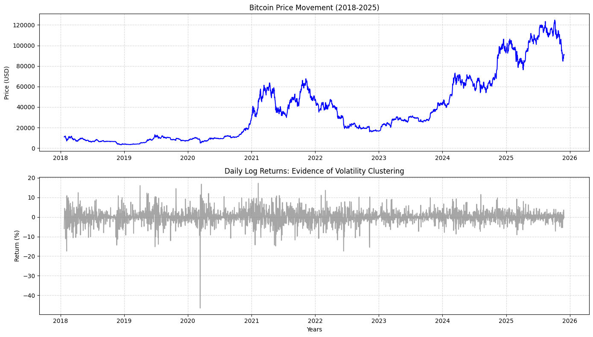
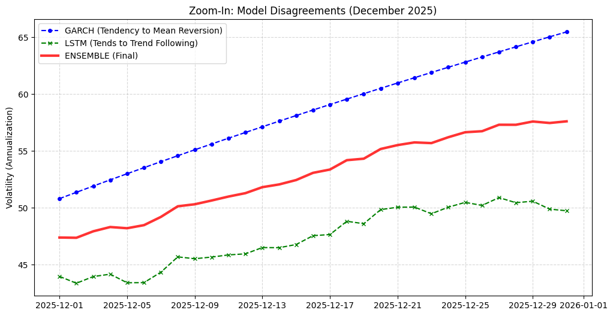

# Forecasting Bitcoin Volatility: A Hybrid Ensemble of GJR-GARCH and Direct-Step LSTM


## 📖 Project Overview

This project implements an advanced quantitative pipeline to forecast **Bitcoin (BTC-USD) Realized Volatility** for **December 2025**.

Addressing the limitations of standard time-series models in crypto markets (non-stationarity, fat tails, and regime changes), this project utilizes a **Hybrid Ensemble Strategy**. It combines the statistical robustness of **GJR-GARCH** with the non-linear pattern recognition of **LSTM (Long Short-Term Memory)** neural networks.

**Key Objective:** To produce a robust, "out-of-sample" volatility forecast that accounts for market asymmetry (leverage effect) and recent market regimes.

---

## 🚀 Advanced Methodology

This project goes beyond basic forecasting by implementing state-of-the-art techniques:

### 1. Statistical Modeling: GJR-GARCH(1,1)

Instead of a standard GARCH, we employ **GJR-GARCH** with **Student-t / Skewed Student-t distributions**.

- **Why:** To capture the **Leverage Effect** (where bad news causes more volatility than good news) and **Fat Tails** (extreme events common in crypto).
- **Auto-Selection:** The model automatically selects the best error distribution based on the lowest AIC (Akaike Information Criterion).

### 2. Deep Learning: LSTM with Direct Strategy

We utilize a highly optimized LSTM network with two critical engineering improvements:

- **Direct Multi-step Forecasting (Vector Output):** Instead of recursive forecasting (using $t+1$ prediction to predict $t+2$), the model predicts the entire 31-day vector for December simultaneously. This **eliminates error accumulation** and prevents the "flatline" issues often seen in long-term recursive forecasts.
- **Exponential Sample Weighting:** A time-decay weighting scheme is applied to the Loss Function. Data from 2024-2025 contributes significantly more to the gradient updates than data from 2018. This forces the model to prioritize **current market regimes**.
- **Hyperparameter Tuning:** Architecture (Layers, Units, Dropout, Learning Rate) is optimized automatically using **Keras Tuner (Hyperband Algorithm)**.

### 3. Ensemble Learning

The final forecast is derived from a **Weighted Average (50:50)** of the GJR-GARCH and LSTM outputs. This "Wisdom of the Crowd" approach reduces variance and provides a hedged prediction against model-specific biases.

---

## 📊 Results & Visualization

### 1. Volatility Clustering & Distributions

Exploratory analysis confirms that Bitcoin returns exhibit significant volatility clustering and heavy tails, validating the need for GARCH models and Student-t distributions.


_(Fig 1. Log Returns showing volatility clusters)_

### 2. Model Comparison (Dec 2025)

The visualization below shows the divergence between the statistical model (Mean Reversion) and the Deep Learning model (Trend Following).


_(Fig 2. Zoom-in on December 2025 Forecast: GARCH vs LSTM vs Ensemble)_

> **Interpretation:** The Red Line (Ensemble) represents the final robust forecast, smoothing out the noise from LSTM while retaining more dynamic range than GARCH.

---

## 🛠️ Installation & Usage

### 1. Clone the Repository

```bash
git clone [https://github.com/HuzainHadi/btc-volatility-forecast.git](https://github.com/HuzainHadi/btc-volatility-forecast.git)
cd btc-volatility-forecast
```
