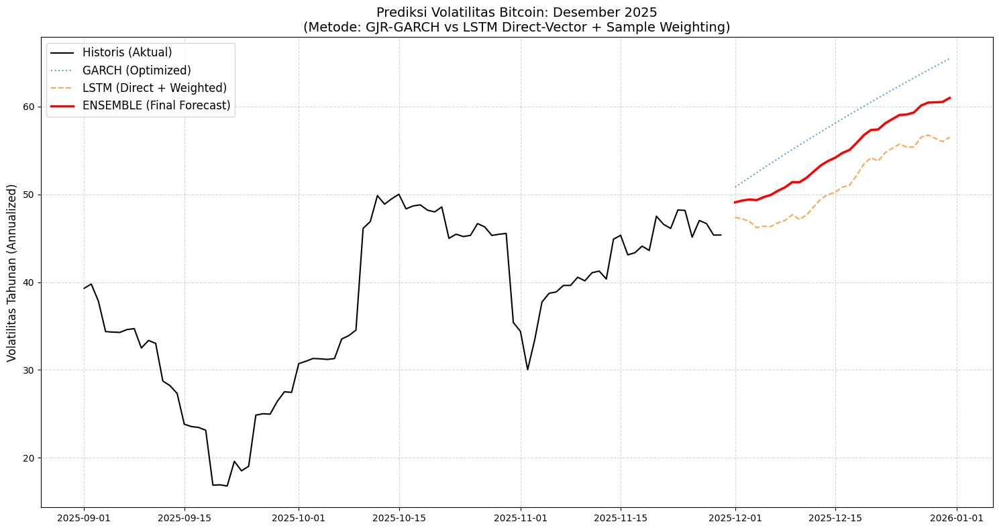

# 📈 Advanced Bitcoin Volatility Forecasting (Dec 2025)


## 📖 Overview

Proyek ini bertujuan untuk memprediksi **Volatilitas Bitcoin (BTC-USD)** untuk bulan **Desember 2025** menggunakan pendekatan hibrida (_ensemble_) antara Ekonometrika Klasik dan Deep Learning modern.

Alih-alih menggunakan metode standar, proyek ini menerapkan teknik tingkat lanjut seperti **Direct Multi-step Forecasting**, **Sample Weighting**, dan **Hyperparameter Tuning Otomatis** untuk mengatasi tantangan _non-stationarity_ dan _volatility clustering_ pada pasar kripto.

Proyek ini disusun sebagai tugas akhir mata kuliah **Topik Khusus Sains Data**.

---

## 🚀 Key Features & Methodology

Proyek ini membandingkan dan menggabungkan dua pendekatan pemodelan yang berbeda:

### 1. Statistical Approach: GJR-GARCH(1,1)

Menggunakan model **GJR-GARCH** dengan distribusi **Student-t**.

- **Kenapa GJR?** Untuk menangkap _Leverage Effect_ (asimetri), di mana penurunan harga (bad news) memicu volatilitas lebih tinggi daripada kenaikan harga.
- **Kenapa Student-t?** Untuk menangkap _Fat Tails_ (kejadian ekstrem) yang sering terjadi di pasar kripto.
- **Auto-Selection:** Algoritma secara otomatis memilih distribusi terbaik berdasarkan skor AIC terendah.

### 2. Deep Learning Approach: LSTM (Direct Strategy)

Menggunakan **Long Short-Term Memory (LSTM)** dengan arsitektur yang dioptimalkan.

- **Direct Multi-step Forecast:** Menggunakan output vektor (31 neuron) untuk memprediksi seluruh bulan Desember sekaligus. Ini menghilangkan masalah _error accumulation_ yang biasa terjadi pada metode rekursif.
- **Sample Weighting:** Menerapkan pembobotan waktu eksponensial. Data tahun 2024-2025 memiliki bobot jauh lebih besar daripada data 2018 saat pelatihan, memaksa model fokus pada rezim pasar terbaru.
- **Automated Tuning:** Menggunakan **Keras Tuner (Hyperband)** untuk mencari jumlah layer, neuron, dropout rate, dan learning rate terbaik secara otomatis.

### 3. Ensemble Learning

Hasil akhir didapatkan dari **Weighted Average (50:50)** antara prediksi GARCH dan LSTM untuk menyeimbangkan stabilitas teori statistik dengan fleksibilitas pola neural network.

---

## 📊 Results Visualization

Berikut adalah hasil peramalan volatilitas (anualisasi) untuk periode 1-31 Desember 2025:



> **Insight:** Garis Merah (Ensemble) menunjukkan jalur volatilitas yang diharapkan, menggabungkan respon cepat dari LSTM dan mean-reversion dari GARCH.

---

## 🛠️ Installation & Usage

1. **Clone Repository**
   ```bash
   git clone [https://github.com/HuzainHadi/btc-volatility-forecast.git](https://github.com/HuzainHadi/btc-volatility-forecast.git)
   cd btc-volatility-forecast
   ```
